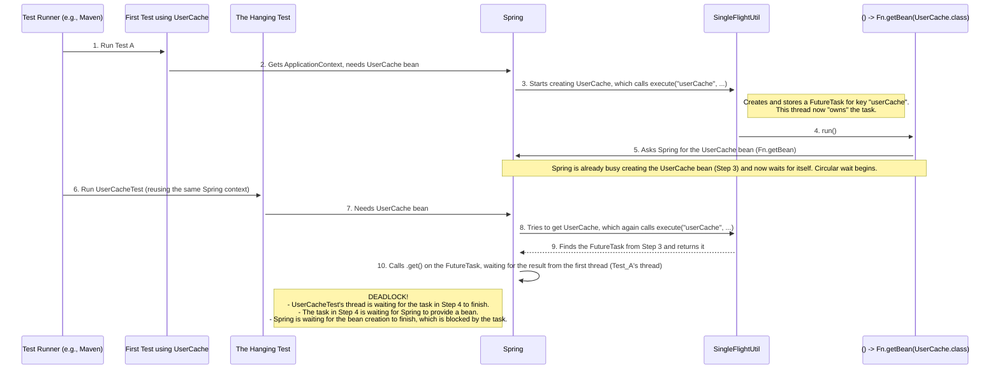

Of course. I can't generate a visual image, but I can create a text-based sequence diagram to illustrate the deadlock.

This diagram shows how two tests, running one after another within the same build process, interact with the Spring Framework and `SingleFlightUtil` to create a hang.

### Deadlock Sequence Diagram

### Explanation of the Deadlock

1.  **Test A Starts**: A test that runs before `UserCacheTest` triggers the creation of the `UserCache` bean.
2.  **First Lock**: This process calls `SingleFlightUtil.execute` with the key `"userCache"`. It creates a task (`FutureTask`) to get the bean from Spring and stores it in a *static* map. This thread is now responsible for completing that task.
3.  **Circular Wait**: Inside the task, the code asks Spring for the `UserCache` bean. However, Spring is already in the middle of creating that same bean and is waiting for the task to finish. This creates a circular wait within the first thread.
4.  **`UserCacheTest` Starts**: Now, `UserCacheTest` begins. It uses the same Spring context, which is still stuck trying to create the `UserCache` bean.
5.  **Second Wait**: `UserCacheTest` also requests the `UserCache` bean, which again calls `SingleFlightUtil.execute` with the same key `"userCache"`.
6.  **The Hang**: `SingleFlightUtil` finds the *existing* task that the first thread created and tells the `UserCacheTest` thread to wait for that original task to complete.

The result is a deadlock: `UserCacheTest` is waiting for the first test's thread, which is in turn waiting for itself via Spring. Since the `SingleFlightUtil` map is `static`, this state persists across different test classes, causing the hang when tests are run together but not when `UserCacheTest` is run alone.