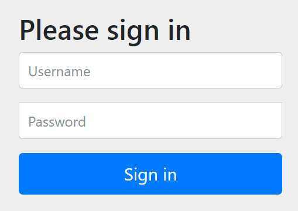
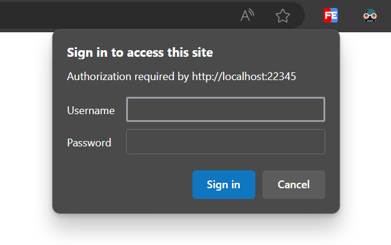

---

# v.0.0.2

Target: use Spring Security's form login page to sign in. Compare the username and password in the database.

How to test:

1. Download the code for tag v.0.0.2.
2. Use MySQL 8's root account to execute the SQL statements in the file huava-init-v0.0.2.sql
3. Run HuavaApplication.java
4. Visit http://localhost:22345/temp/test/secured , it will be redirected to http://localhost:22345/login page.
5. Use `admin` as username, `123456` as password to login, it will go back to  http://localhost:22345/temp/test/secured page.

---

# Worth mentioning 

---

## 1. A great article

[Introduction to Spring Security Architecture - Rasheed Shaik](https://medium.com/@rasheed99/introduction-on-spring-security-architecture-eb5d7de75a4f)


---

## 2. maven dependency 

```xml
<dependency>
  <groupId>org.springframework.boot</groupId>
  <artifactId>spring-boot-starter-security</artifactId>
</dependency>
```

---

## 3. Spring Security Default Behaviour 

In the class [SpringBootWebSecurityConfiguration](https://github.com/spring-projects/spring-boot/blob/15569d0b243ee4dc784e4387ffe41731fa9e593b/spring-boot-project/spring-boot-autoconfigure/src/main/java/org/springframework/boot/autoconfigure/security/servlet/SpringBootWebSecurityConfiguration.java#L58), if the user does not specify their own SecurityFilterChain bean, then all requests need to be authenticated first; if not, the user will be redirected to the form login page. But the thing is, we have a default login page, but we don't have a default username and password. So the default behavior of Spring Security is useless.

```java
@Bean
@Order(SecurityProperties.BASIC_AUTH_ORDER)
SecurityFilterChain defaultSecurityFilterChain(HttpSecurity http) throws Exception {
	http.authorizeHttpRequests((requests) -> requests.anyRequest().authenticated());
	http.formLogin(withDefaults());
	http.httpBasic(withDefaults());
	return http.build();
}
```

A form login page looks like this:



A http basic login page looks like this (pops up a dialog, not recommended):



## 